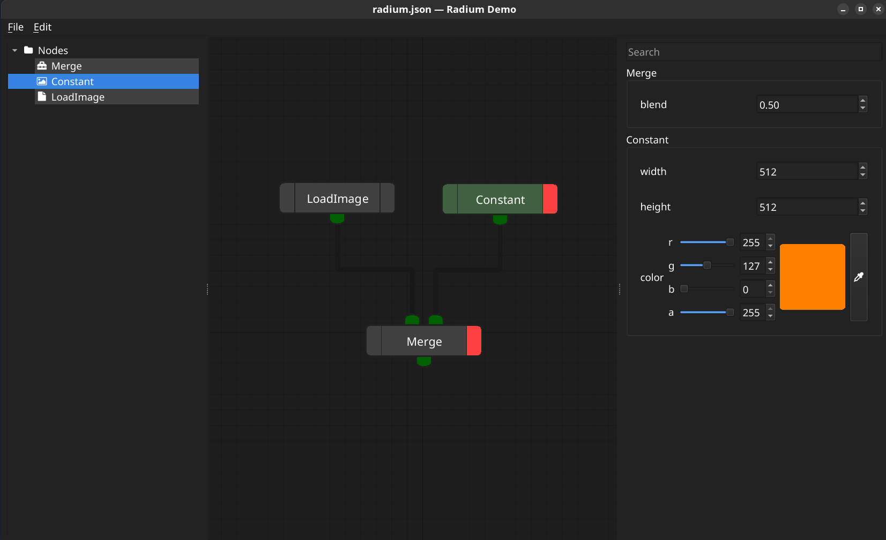

# Radium Nodes

A no frills, vertical node-graph editor for PySide6.


```python
"""
Drag from ports to edges to make connections.
Edit edges by dragging them (not their ports)

Alt-Drag nodegraph to duplicate them.
Ctrl-Drag connections to add corners.

Middle Drag background to pan view.

"""

import os
from PySide6 import QtWidgets
from radium.nodegraph import NodeGraphView
from radium.nodegraph import NodeGraphController
from radium.nodegraph import NodePrototype, PortPrototype

os.environ["QT_SCALE_FACTOR"] = "2"

app = QtWidgets.QApplication([])
view = NodeGraphView()

controller = NodeGraphController()
view.setScene(controller.scene)

main_window = QtWidgets.QMainWindow()
main_window.menuBar().addAction(controller.undo_stack.createUndoAction(app))
main_window.menuBar().addAction(controller.undo_stack.createRedoAction(app))
main_window.setCentralWidget(view)
main_window.show()

merge_prototype = NodePrototype(
    "Merge",
    inputs=(PortPrototype("input1", "image"), PortPrototype("input2", "image")),
    outputs=(PortPrototype("output", "image"),),
    parameters=tuple(),
)
controller.createNode(merge_prototype)
controller.createNode(merge_prototype)
controller.createNode(merge_prototype)
controller.createBackdrop("Backdrop")

app.exec()
```